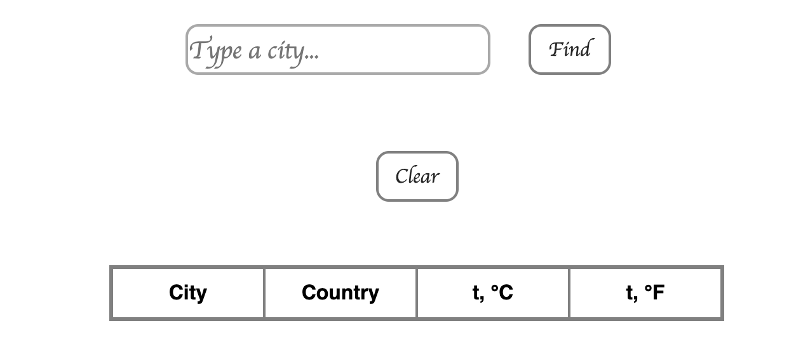
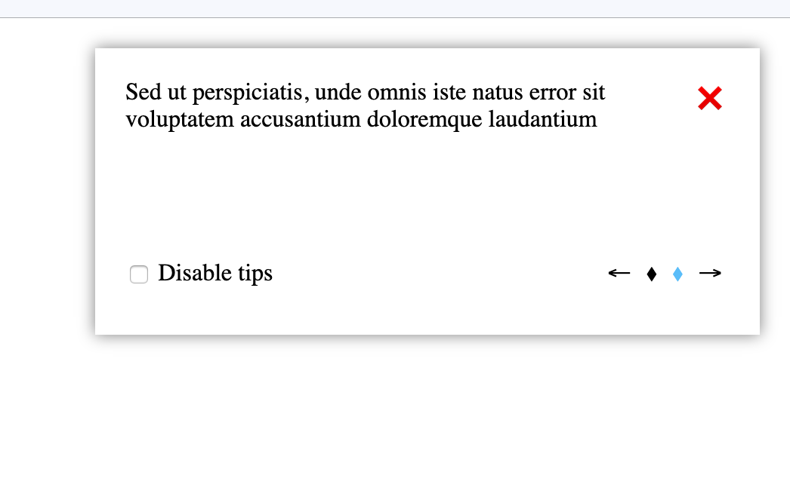
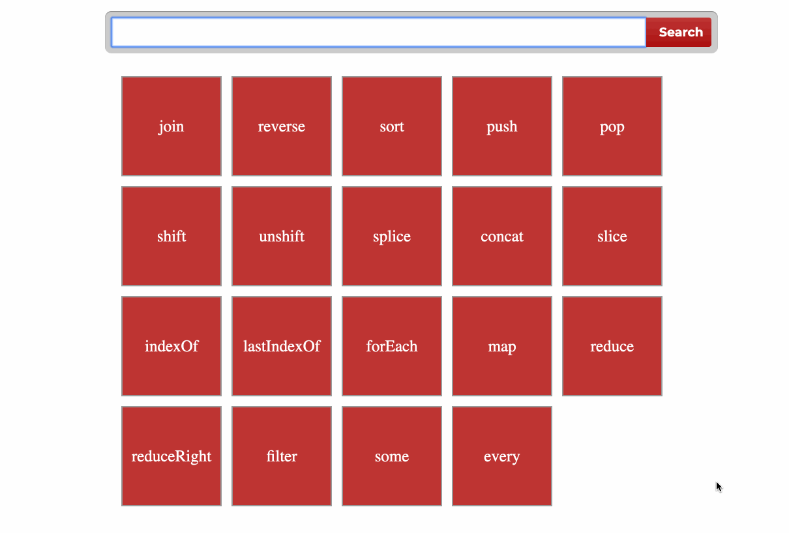

### ✅ Create a simple  **TODO**-list

#### [Getting Started with Redux](https://egghead.io/courses/getting-started-with-redux)
---

- your application should do the following: 
    - add `todo` using component `Form`;
    - display a list of your `todo`;
    - every `todo` should have buttons `delete` and `done` (button `done` should work the same way as undoing an action);
    - it must be possible to display `all`, `done` and `active` todos;
    ---
    ##### Optional:
    - use [`styled-components`](https://www.styled-components.com/) for styles;
    - use `localstorage` to save application state;
    - use [`react-router-dom`](https://reacttraining.com/react-router/web/guides/philosophy) for routing (for example pages `all`, `done`, `active`, `not found`);
    ---
---
### How the application might look like:


## ES6. Destructuring. Functions.

* [Presentation](https://slides.com/danielsuleiman/es6#/)


## Hometask
* Downdload [this](https://github.com/tr3v3r/destructuring)
* Clone your **TMS-your-name** repository
* Copy downloaded folder into you project
* Commit changes and push into master of your TMS-your name repository

* Create and switch to branch with name **desctructuring**
* Create folder with name **desctructuring**
* Open **desctructuring** folder in your VSCode / WebStorm
* `npm install`
* Open **test** folder and fix all tests
* Run `npm run test ./test/file name.js` to check. ( i.e. for **string.js** `npm run test ./test/string.js` )
* Push branch and open Pull Request

### Example
* Open file **test/array.js**
* take first task
```
 it('extract value from array, e.g. extract 0 into x like so `let [x] = [0];`', () => {
      let firstValue = [1];
      assert.strictEqual(firstValue, 1);
 });
```
* Change code inside **it** to pass test
```
 it('extract value from array, e.g. extract 0 into x like so `let [x] = [0];`', () => {
      let [firstValue] = [1];
      assert.strictEqual(firstValue, 1);
 });
```
* `npm run test ./test/array.js`


## Git, JS, DOM

* [Presentation](https://slides.com/danielsuleiman/git#/)
* JS assignments
  * Fork [this](https://github.com/tr3v3r/js-assignments) repository
  * Add **tr3v3r** as collaborator
  * Clone repository
  * install node js
  * `npm install`
  * Solve first task from **task/01-strings-tasks.js**
  * Push changes to the repo
* JS test (45 min)
* Simple-counter
  * Clone [this](https://github.com/tr3v3r/simple-counter) repository
  * Add counter functionality
  * Push changes

## Hometask
* Create repository *TMS-your name* (example: TMS-Aliaksei-Astafyeu)
* Add **tr3v3r** as collaborator
* Add **README.md** file and put your full name there

* **Downdload** (NOT CLONE) [this](https://github.com/tr3v3r/js-assignments)
* **Clone** (NOT DOWNLOAD) your **TMS-your-name** repository to your home PC
* Copy **js-assignments** folder into you project
* Commit changes and push into master of your *TMS-your name* repository

* Create and switch to branch with name **js-assignments**
* `npm install`
* Solve:
  * **first 4** task **from 01-strings-tasks.js** 
  * **first 4** task **from 01-numbers-tasks.js**
  * **first 4** task **from 01-arrays-tasks.js**
* To check if task solved run `npm run test`
* Make commit after **every** solved task!
* Push branch to github
* Create *pull request* and add **tr3v3r** as reviewer


## Async development

* [Presentation](https://sulemanof.github.io/js-lectures/async-development/presentation/#/)
* Weather app
  * Go to [Weather stack](https://weatherstack.com/) and create account
  * Clone [this](https://github.com/tr3v3r/weather-app) repository
  * Using [Weather stack api](https://weatherstack.com/documentation) fetch weather for the data from input
  * Render weather for each city in the table
  * If weather for city has already fetched - replace it
  * On **Clear** button press - clear table
  * If table has no raws - hide it




## Hometask
* Clone your **TMS-your-name** repository
* Create folder with name **weather-app** in master branch
* Copy files from repository from *class work* to **weather-app** folder
* push your changes into master
* Create and switch to branch with name **weather-app**
* Open **weather-app** folder in your VSCode / WebStorm
* Go to [locationiq](https://locationiq.com/) and create account
* Take **lat, lan** data from weather api response and using **locationiq** [api](https://locationiq.com/docs#forward-geocoding) put map under the table with marker on the folowing location.

## Exampe 
* After fetching weather data for *New York* you'll get response like:
```
{
    "request": {
        "type": "City",
        "query": "New York, United States of America",
        "language": "en",
        "unit": "m"
    },
    "location": {
        "name": "New York",
        "country": "United States of America",
        "region": "New York",
        "lat": "40.714",
        "lon": "-74.006",
...
```
* Take **lat**(latitude) and **lan**(longitude) and render map with marker on this point


## DOM. BOM

* [Presentation](https://slides.com/danielsuleiman/dombom/#/)
* Notifications
  * Clone [this](https://github.com/tr3v3r/notification) repository
  * Notification must be shown after page loads and hide after 5 seconds.
  * Closing icon. Click on it closes the component
  * Checkbox that disables notification and sets a flag into local storage. If the flag is set, component won't be shown when the page reloads
  * Add logic for arrows ( left/ right ). Change notification text and active dot.
  * Keyboard support. Component supports keyboard control: switching back and forward, closing by clicking on the cross.



## Hometask ( Upgrade you weather-app)
### To do this task please complete class fork from [previous classes](https://github.com/tr3v3r/TMS/blob/master/Async.md)
* Clone your **TMS-your-name** repository
* Create and switch to branch with name **weather-app-bom**
* Add a **My weather** button, clicking it wil interact with **navigator.geolocation** API and fetch weather data of your current location;
* Store fetched data at the localstorage and render it in the a table;
* Update your data from a localstorage with the newest from the server when access the app; ( When open page you shuld take all saved cities and re-fetch data )
* After competing the task maket pull request for review


## NPM. Modules

* [Presentation](https://slides.com/danielsuleiman/npm#/)	
* Install [browserify](http://browserify.org/)	
* Install [babelify](https://github.com/babel/babelify)
* Implement Counter based on modules	
  * Create folder **modules** and **idnex.js** inside	
  * Create module **Counter.js** (class with state, and methods for increment / decrement)
  * Create module **Element.js**. Class wich should work like:
```	  * Create **src** folder

// Element.js

class Element {
    constructor(elem) {
       
    }

    addClassName(className) {
     
    }

    onClick(callback) {
       
    }

    update(children = []) {

    }

    render(children = []) {
       
    }    
}


// decrementButton.js

import { Element } from './Element'

 export const decrementButton = new Element('div')
.addClassName('button')
.addClassName('center')
.addClassName('decrement')


// index.js

import { decrementButton, incrementButton, counterBlock, wrapper, container, Counter }  from './modules'


const counter = new Counter()

counter.onChange(currentValue => {
 counterBlock.update([currentValue])


document.body.append(
     wrapper.render([
        counterBlock.render([counter.currentValue]),
        container.render([
            leftButton.onClick(counter.dicrement).render(['-']),
            resetButton.onClick(counter.reset).render(['#']),
            rightButton.onClick(counter.increment).render(['+'])
        ])
    ])
 )
})
```	

* Everything should work without any html tags inside.	


* styles you can find [here](https://github.com/tr3v3r/simple-counter/blob/master/styles.css) 
  
## Hometaks
Rewrite your **weather-app** using modules.

Your app should consist of at least several modules. i.e.
* Module for fetching data
* Module for rendering and manging map
* Module for rendering and mangin table
* Module for handling localstorage
* Module createElement 


## Webpack

* [Presentation](https://slides.com/danielsuleiman/webpack/#/)
* clone [this](https://github.com/tr3v3r/webpack-search)
* **npm init**
* **npm i --save-dev webpack**
* **npm i --save-dev webpack-cli**
* **npm i --save-dev style-loader**
* **npm i --save-dev css-loader**
* create **webpack.config.js** and set up config (*style-loader*, *css-loader* with modules support, *html-webpack-plugin*)
* Implement Search/Add. 
  * Create **src** folder
  * Try to split your logic into modules ( i.e. Form, Box, Store ) 




